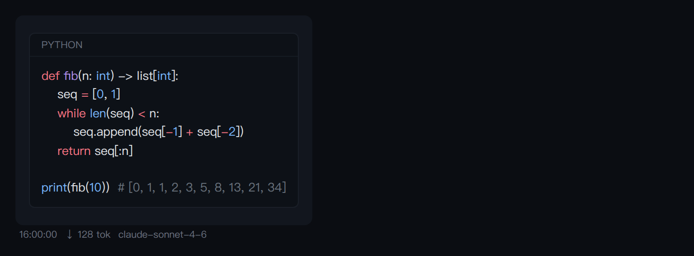
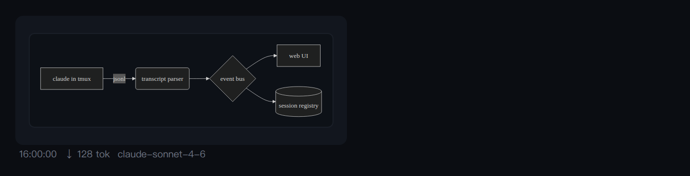
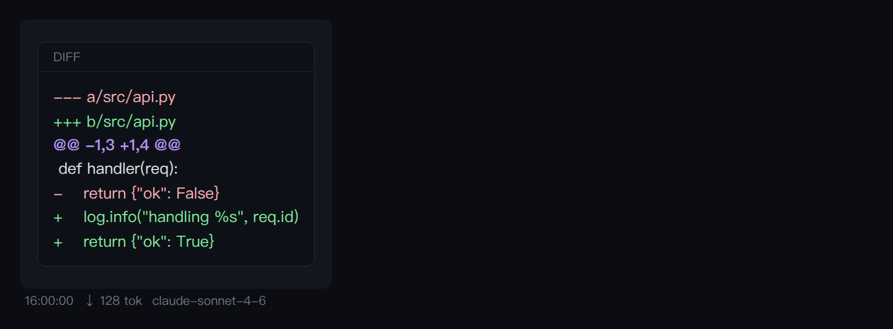
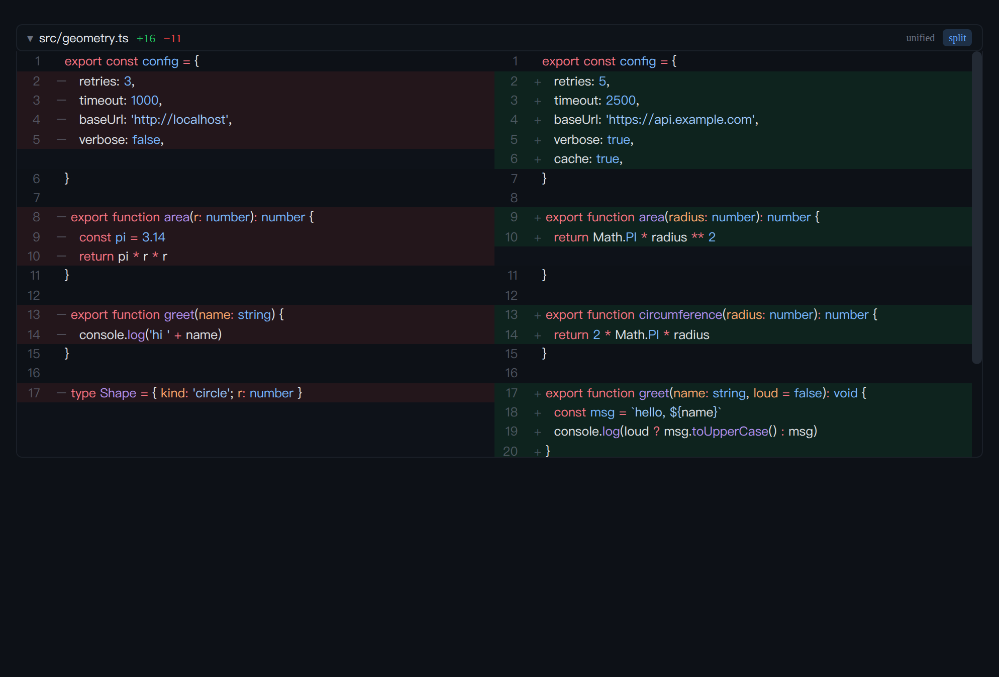

# muxdesk-web

The React/Vite frontend for [muxdesk](https://github.com/Decayo/muxdesk) — a
terminal-native cockpit for interactive AI CLI sessions running in tmux.

This repo is the **web UI only**; it talks to the `muxdesk` backend over the
`/api/muxdesk` REST/WS contract. Start the backend first.

## Run

```bash
# 1. backend (see the muxdesk repo)
pip install "muxdesk[server]"
MUXDESK_WORKSPACE=~/your/project python3 -m uvicorn muxdesk.app:app --port 8001

# 2. this frontend (dev server proxies /api → :8001, incl. WebSocket)
npm install
npm run dev          # → http://127.0.0.1:5274
```

Point at a different backend with `VITE_BACKEND_URL` (default `http://127.0.0.1:8001`).
A Nerd Font is recommended for Claude's TUI box-drawing/icons; override the terminal
font with `VITE_MUXDESK_TERMINAL_FONT`.

```bash
npm run build        # tsc + vite production build → dist/
npm test             # vitest (unit tests for src/lib)
```

## Rendering

Assistant messages render through `MxMessage` (react-markdown + remark-gfm). The
`pre` handler dispatches fenced blocks by language:

| fenced ` ```lang ` | renders as |
|--------------------|-----------|
| `mermaid`          | diagram (`Mermaid`) |
| `diff`             | two-layer diff (`CodeDiff`) — ≤20 changed lines inline, larger collapses to a `+N −M` summary that opens a scrollable panel with a **unified / split** toggle |
| `html` / `canvas`  | `<iframe sandbox="allow-scripts">` (`SandboxedFrame`) — runs/draws in an opaque origin, no parent/cookie/storage access |
| anything else      | shiki syntax highlight (`CodeBlock`, github-dark, lazy per-language) |

Sample output — syntax highlight, a rendered mermaid diagram, and an inline diff
(all via the real `MxMessage` dispatch above):

| | |
|---|---|
|  |  |
|  |  |

The event stream (`MxEventStream`) folds consecutive tool calls into collapsible
**WORK LOG** groups; `Edit`/`Write` entries show an inline diff built from the
tool input. Pure grouping/dedup logic lives in `src/lib/eventGroups.ts`
(unit-tested): events are deduped by stable identity (`tool_use_id` / `uuid`+text,
**not** seq, which is a re-emittable emission counter) and tool_start/tool_end are
paired globally so an interleaved event can't orphan a result.

> The expanded diff panel offers **unified** (shiki "diff" lexer, red/green lines)
> and **split** (side-by-side old | new columns, each highlighted in the *source*
> language via shiki `codeToTokens`). The split row model — `buildSplitRows` in
> `src/lib/diff.ts` — is pure and unit-tested (GitHub-style run zipping). Worker-
> virtualized rendering for very large (1000s-of-line) diffs remains a follow-up;
> the panel scrolls within `max-h-[60vh]`, which is enough for typical agent edits.

The conversation has a **Focus / Full** toggle (Focus hides internal thinking)
and a stick-to-bottom scroller that follows new content only while you're parked
near the bottom (it survives async highlight/iframe reflow via a `ResizeObserver`).

## Status bar

A cmux-style segmented bar (`MxStatusBar`) under the conversation:

```
Sonnet 4.6 │ AUTO · READY │ ctx 16% 32k/200k │ 📁 mux-demo-ws │ ⎇ main~3 │ ⌨ 2 │ Σ 1.2k tok
```

Front-end-aggregated segments (model / mode·state / cwd / Σ tokens) come from data
the client already holds; `ctx` (peak context %), `⎇` git branch+dirty, and `⌨`
shell count are fed by `GET /api/muxdesk/sessions/{id}/status` (polled). All
backend-fed segments degrade gracefully — they're simply omitted on older backends.

## Command palette

Typing a lone `/cmd` in the input opens a candidate palette (`MxChatInput` +
`src/config/slashCommands.ts`): prefix-filtered, ↑/↓ + Enter/Tab to accept, Esc to
dismiss, IME-safe. Candidates are the built-in claude commands merged with the
session's own `.claude/commands` + `.claude/skills` from
`GET /api/muxdesk/sessions/{id}/commands` (falls back to built-ins if absent).

## Session tree & bind (module 4)

The sidebar has **Date / Tree / Project** grouping (`MxSessionSidebar` +
`src/lib/sessionViews.ts`). **Bind** a session as a child by dragging it onto another, or — for
keyboard access — via the row's *bind* action (which opens the dialog with a parent dropdown). The
**bind wizard** (`BindDialog`) assembles a contract: an empty form is a quick *ephemeral* bind;
otherwise pick any of a **mission**, a **deliverable** shape (preset → `output_schema`, validated
each check-in), **guardrails** (a blocklist enforced by the child's PreToolUse hook), and a
**check-in cadence** (`on_stop` / `every_turn` / `manual`). `POST …/bind` validates the contract +
rejects cycles; bound rows show an `unbind` action. When the active session has children, a
**BOUND CHILDREN** monitor
(`MxChildMonitor`) shows each child's state + live preview with a **relay** box
(parent → child via `POST …/relay`) and an *open* button. A child's check-in
(`child_checkin` pushed to the parent's event bus) renders as a card in the parent
conversation. Every bind/relay/status call degrades gracefully when the backend
lacks the endpoint.

## Layout

- `src/components/muxDesk/*` — chat (`MxEventStream`, `MxMessage`), rendering
  (`CodeBlock`, `CodeDiff`, `WorkLog`, `SandboxedFrame`, `Mermaid`), status bar
  (`MxStatusBar`), command input (`MxChatInput`), session sidebar
  (`MxSessionSidebar`), child monitor (`MxChildMonitor`), agent graph
  (`MxTeamPanel`), structured ask cards (`AskUserQuestionCard`), terminal
  (`MxTerminal`), model picker, preflight banner.
- `src/pages/*` — `MxDeskPage`, `MxDeskWorkbench`.
- `src/lib/*` — pure, unit-tested helpers: `shiki` (highlighter), `diff` (patch
  build/classify), `eventGroups` (tool grouping + dedup + view mode),
  `sessionViews` (tree / project / children), `format`, `utils`.
- `src/config/*` — `slashCommands` (command palette source).
- `src/{stores,hooks,api}` — zustand stores (`sessionStore`, `transcriptStore`,
  `uiStore`), stream hook (`useMxDeskStream`), terminal hook (`useMxTerminal`),
  REST client (`api/muxDesk.ts`).

## Contract

The frontend detects the structured-ask channel (`Skill` / `Bash` `muxdesk-ask`) and
pasted-image paths (`/tmp/muxdesk-img`) **by convention** — keep these in lock-step
with the backend. See the backend repo's `CONTRIBUTING.md`.

## License

MIT © Decayo
